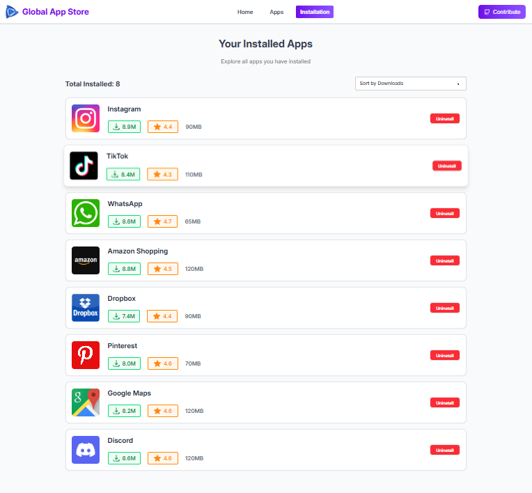

# 🌐 Global Apps Store

**Global Apps Store** is a modern web application inspired by Google Play Store and Apple App Store. It is a centralized platform where users can explore, download, review, and rate a wide variety of applications. This project demonstrates a sleek, responsive UI combined with powerful functionality for app browsing and community interaction.

---

## 🔗 Live Demo
[👉 Visit Global Apps Store](https://global-app-store-smr.netlify.app/)

---

## 🚀 Features

- **App Browsing:** Explore a wide range of apps categorized for easy discovery.  
- **Download Apps:** Users can download apps directly from the store interface.  
- **Reviews & Ratings:** Write reviews, leave ratings, and view other users’ feedback.  
- **Search Functionality:** Quickly find apps using the search bar.  
- **Responsive Design:** Works seamlessly on mobile, tablet, and desktop.  
- **User Notifications:** Toast notifications for important actions and events.  

---

## 🛠 Technologies Used

- **React** – Component-based UI for efficient development.  
- **JavaScript** – Core programming language for interactivity.  
- **Tailwind CSS** – Utility-first CSS framework for fast styling.  
- **DaisyUI** – Tailwind CSS component library for modern UI elements.  
- **React Router** – Handles client-side routing.  
- **React Toastify** – For sleek, customizable toast notifications.  
- **Lucide React Icons** – Beautiful icons for enhanced UI.  
- **Other Tools & Libraries** – Various utilities for enhanced user experience.

---

## 📸 Screenshots

### 🏠 Home Page

### 📱 All App

### 🌟 App View Section

### ✅ Installation 

---

## 🙌 Acknowledgements

Inspired by Google Play Store & Apple App Store

Tailwind CSS & DaisyUI for amazing styling

React Toastify for notification system

Lucide React for icons

---

**Made with ❤️ using React, JavaScript, Tailwind CSS, and DaisyUI**

